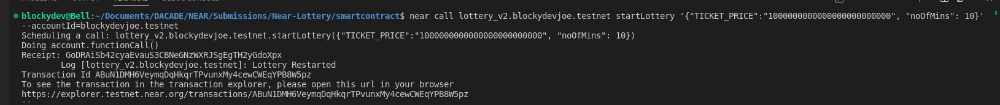
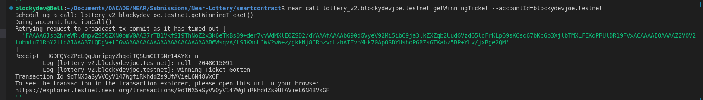
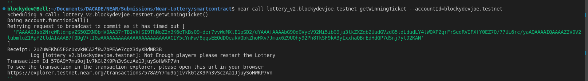
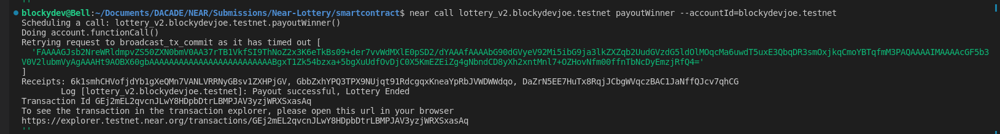

# NEAR Lottery

[link to dapp](https://JoE11-y.github.io/Near-Lottery)

A simple lottery contract that awards a lucky winner with a half of the generated prizepot.
Lottery is currently set to run every 2 days as a default.

Check **Operator** section for how to operate lottery.

## Update
Due to request from testers, lottery has been set to run every 3 hours, but this parameter can be modified on each lottery start.


## 1. Tech Stack
This boilerplate uses the following tech stack:
- [React](https://reactjs.org/) - A JavaScript library for building user interfaces.
- [near-sdk-as](contractkit
) - A frontend library for interacting with the Near Protocol Testnet.
- [Bootstrap](https://getbootstrap.com/) - A CSS framework that provides responsive, mobile-first layouts.


## 2. Quick Start

To get this project up running locally, follow these simple steps:

### 2.1 Clone the repository:

```bash
git clone https://github.com/JoE11-y/Near-Lottery.git
```

### 2.2 Navigate to the directory:

```bash
cd Near-Lottery
```

### 2.3 Install the dependencies:

```bash
npm install
```

### 2.4 Run the dapp:

```bash
npm start
```

To properly test the dapp you will need to have a Near testnet account.
[Create Account](https://wallet.testnet.near.org/)


## 3. Smart-Contract Deployment

### 3.1 Navigate to the contract directory:

```bash
cd contract
```

### 3.2 Install the dependencies:

```bash
yarn install
npm install near-cli
```

### 3.3 Compile the smart contract

```bash
yarn asb
```

### 3.4 Deploy the smart contract to the Near Protocol Testnet

```bash
near deploy --accountId={ACCOUNT_ID} --wasmFile=build/release/near-lottery.wasm
```

This command will deploy the contract to the accountId on the testnet. The accountId now becomes the contract name


## 4. Operator Section -- Following updates from PR #1

This section contains node-js terminal scripts to be run to control the operation of the lottery.

### 4.1 Setting the operator

```bash
near call {contractname} init '{"operator":"{operatorAccount}"}' --accountId={contractname}
```

This sets the operator account giving that account access to functions like starting the lottery and other operator restricted functions, ticketPrice is in yoctoNear (10^24) Near.

### 4.2 Starting the Lottery

```bash
near call {contractname} startLottery '{"TICKET_PRICE": "{ticketprice}", "noOfMins": "{noOfMins}"}' --accountId={operatorAccount}
```

This command will start a new lottery session

### 4.3 Getting the winning ticket

```bash
near call {contractname} getWinningTicket --accountId={operatorAccount}
```

This command gets the winning the ticket for that lottery session, can be only ran once the current lottery session time range has been exhausted.

### 4.4 Payout Winner

```bash
near call {contractname} payoutWinner --accountId={operatorAccount}
```

This command pays out the winner, after the winning ticket has been gotten. The function also sets the lottery state to idle, meaning a new lottery session can be started. It also sends out a portion of the remaining amount in the lottery to the contract owner, while the rest are left as storage fees for the contract.

### 5.4 Example Scenarios
- To start the Lottery

- To get Winning tickets
    - Successful Lottery
    
    - Restart Lottery
    
- To pay out to winner



## Dev Opinion
A much better implementation would be to use either oracles or a collab with chainlink to use their keeper service for contract automation
